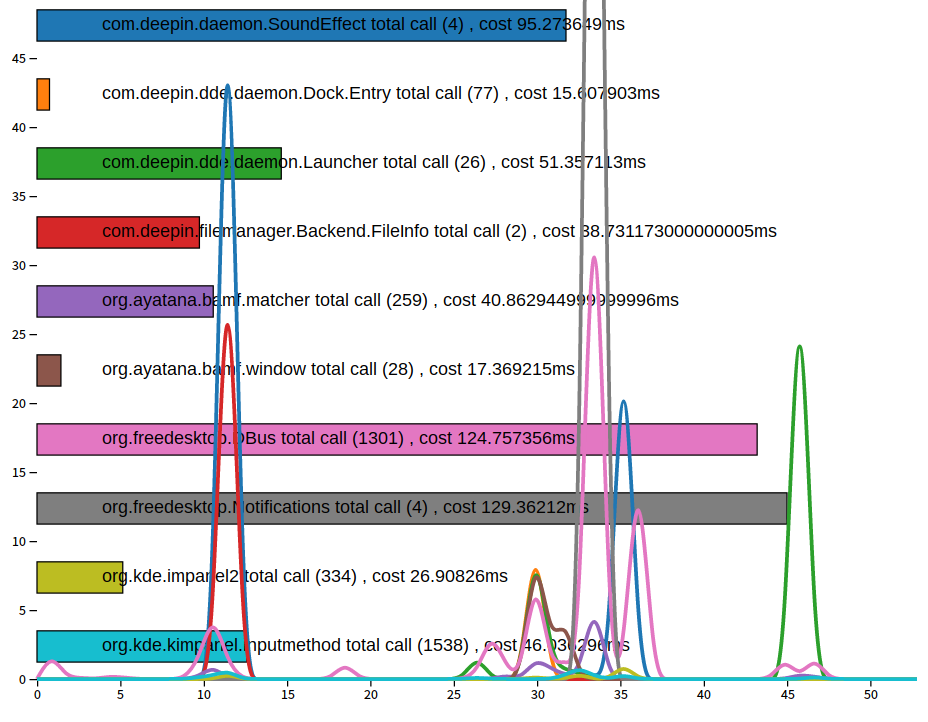
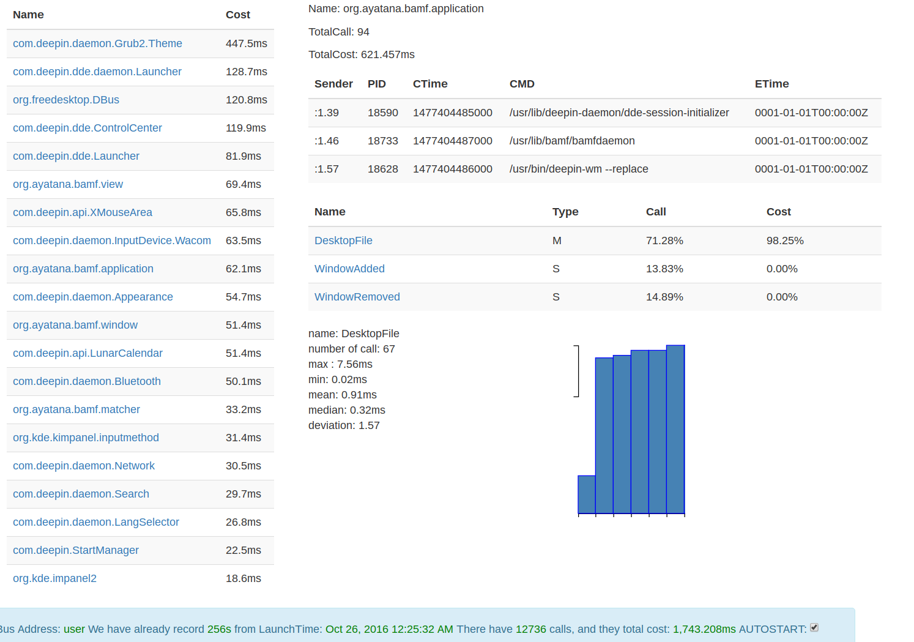

What's it

``` sh
NAME:
   dbus-profiler - Profiling dbus message with beautiful, dynamical UI and realtime data

USAGE:
   dbus-profiler [global options] command [command options] [arguments...]

VERSION:
   0.1

AUTHOR(S):
   snyh <snyh@snyh.org>

COMMANDS:
     help, h  Shows a list of commands or help for one command

GLOBAL OPTIONS:
   --bus_addr value, -a value     monitor arbitrary message from the bus ADDRESS [system|user|$dbus_address] (default: "user")
   --server_addr value, -s value  the address to bind for serving, [127.0.0.1:8080|auto] (default: ":7799")
   --quiet, -q                    disable auto launch web browser
   --help, -h                     show help
   --version, -v                  print the version

```

Screenshot





INSTALL

``` sh
sudo apt-get install libpcap-dev socat
go get -v github.com/snyh/dbus-profiler
```


TODO

- [ ] Caller process information recording and rendering
- [ ] Better d3.js rendering
- [ ] dependencies parsing and live rendering
- [ ] Custom Search key = [cost, mean, max, name, number, ...]
- [ ] Auto relase notify
      by parsing https://github.com/snyh/dbus-profiler/releases.atom
- [X] Auto start support for profiling when DE start up
- [ ] improve the performance and food print of  dbus-profiler
- [ ] data upload and replay for comparing with history result
